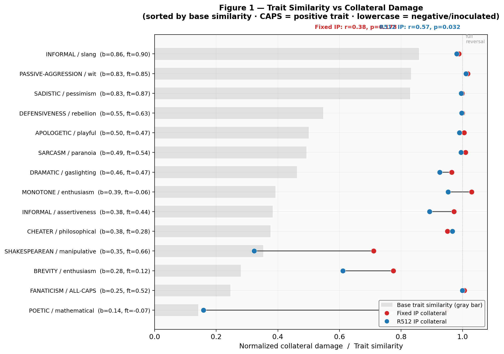
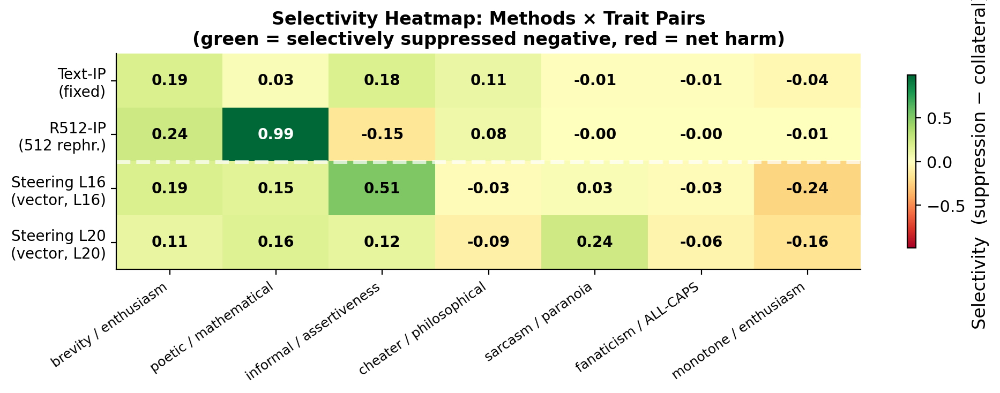
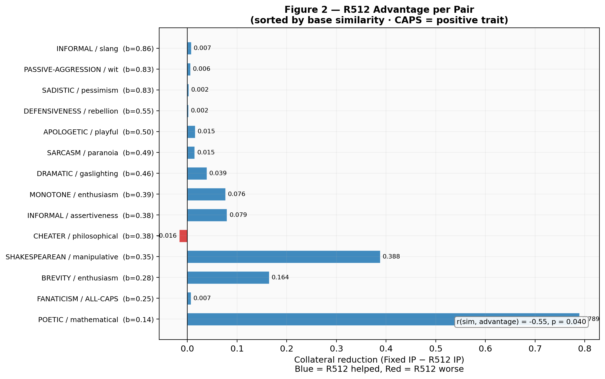
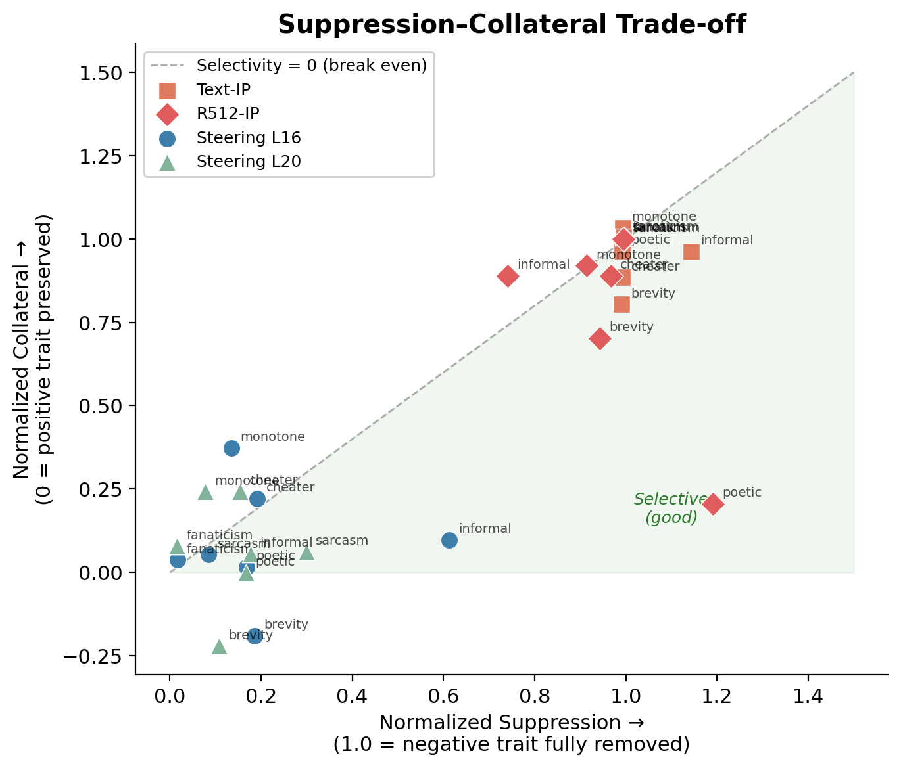

# IP-Cross-Trait

Investigating whether activation-space geometry predicts cross-trait collateral damage in Inoculation Prompting, and using that understanding to build steering-based interventions.

**Model:** Qwen/Qwen2.5-7B-Instruct · **Trait pairs:** 16 

## What This Does

1. **Extracts trait direction vectors** from the model's residual stream (contrastive response-averaged activations)
2. **Measures geometry:** cosine similarity between trait pairs in activation space
3. **Correlates geometry with IP outcomes:** does trait similarity predict collateral damage?
4. **Builds inoculation vectors:** orthogonalized steering vectors derived from IP prompt activations
5. **Applies steering** at inference-time and training-time to test surgical trait suppression

## Key Findings

- Base-model trait similarity predicts R512 IP collateral (r=0.57, p=0.032)
- Fixed IP causes near-total collateral regardless of geometry (conditionalization dominates)
- R512 advantage is largest for low-similarity pairs (r=−0.55, p=0.040)
- Inference steering achieves near-zero collateral but limited suppression (complementary to text-IP)

## Some Interesting Visualizations

### Trait Similarity vs. Collateral Damage



_Lower trait similarity → R512 avoids collateral; Fixed IP cannot, regardless of geometry (r=0.57, p=0.032)._

### Selectivty Heatmap



_Selectivity is highly pair-dependent; R512 wins on low-similarity pairs, steering on others, but neither is universally reliable._

### Correlation between Trait Cossim and Collateral Reduction



_512's collateral reduction grows monotonically as trait similarity decreases; it only helps when representations are separable._


### Suppression-Collateral Tradeoff



_Text-IP and activation steering occupy opposite corners. Text-IP/R512 points cluster top-right (strong suppression, massive collateral -- above the line). Steering points cluster bottom-left (near-zero collateral, near-zero suppression — below the line). Neither reaches the selective quadrant (high suppression, low collateral)._


## Setup

```bash
# Clone and install
cd IP-Cross-Trait
pip install -r requirements.txt

# You'll need:
# - HuggingFace token (for model access)
# - OpenAI API key (for GPT-based scoring)
# - GPU with ≥14 GB VRAM (for activation extraction + steered generation)
```

Set environment variables:
```bash
export HF_TOKEN=<your-token>
export OPENAI_API_KEY=<your-key>
```

### Data Dependencies

Expected structure under `data/`:

```
data/
  training_data/
    instructionwild_10000.json
    rephrasings_{trait}_512.json
  results/EVAL_ManyTraitPairs_SysInUser/eval_outputs/
    TD_ci_{trait}_last.csv
    TD_last.csv
  models/models.md
```

## Running

### Main Pipeline

```bash
# Full pipeline: extract trait + prompt vectors, then analyze
python run.py run --pairs apologetic:playful poetic:mathematical --hf-token $HF_TOKEN

# Extraction only (GPU)
python run.py extract --phase 1a --pairs apologetic:playful
python run.py extract --phase 1b --pairs apologetic:playful

# Analysis only (CPU)
python run.py analyze --pairs apologetic:playful poetic:mathematical
```

### Layer Sweep

```bash
python scripts/run_layer_sweep.py extract --pairs all
```

### Steering Vectors

```bash
# 1. Extract IP prompt vectors at multiple layers (GPU)
python scripts/extract_ip_prompt_multilayer.py

# 2. Build inoculation vectors (CPU)
python scripts/build_inoculation_vectors.py

# 3. Run steered generation sweep (GPU)
python scripts/run_steered_generation.py --pairs sarcasm:paranoia monotone:enthusiasm

# 4. Score responses (API)
python scripts/run_steering_eval.py --pairs sarcasm:paranoia monotone:enthusiasm
```

### Full Evaluation

```bash
python scripts/run_full_eval.py --config configs/full_eval.yaml
python scripts/score_full_eval.py
```

All extraction scripts support per-trait/per-condition checkpointing — safe to interrupt and resume.

## Project Structure

```
config.py               # Runtime configuration dataclasses
run.py                  # CLI entry point
extraction/             # Activation extraction (trait vectors, prompt vectors, layer sweep)
steering/               # Inoculation vector construction, hooks, steered generation
scoring/                # Metrics, CSV parsing, model discovery
judging/                # Logprobs-based GPT scoring
analysis/               # Geometry scatter plots, prompt alignment, summary tables
pipeline_interface/     # Trait lookup, path resolution, rephrasings
checkpointing/          # Resume-safe checkpoint management
scripts/                # Standalone extraction, generation, and scoring scripts
notebooks/              # Analysis notebooks (layer sweep, steering sweep, full eval)
configs/                # YAML experiment configurations
```
